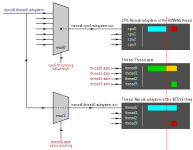

# Mux

The emulator provides a mechanism to interconnect [channels](../channels) in a
similar way as an [analog
multiplexer](https://en.wikipedia.org/wiki/Multiplexer) by using the `mux`
module.

Multiplexers or muxers have one output channel, one select channel and a
variable number of input channels (including zero). Each input channel is
registered in the multiplexer by using a key with a given value. In the normal
operation of a mux, the value of the select channel is used to find an input
with a matching key. When there is no match, the output value is set to null.

Multiplexers can be configured to execute a custom select function, which will
take the value of the select channel and determine which input should be
selected. This allows a multiplexer to act as a filter too.

## Tracking

The typical use of multiplexers is to implement the tracking modes of channels.
As an example, the following diagram shows two multiplexers used to implement
the subsystem view of [Nanos6](../nanos6):

The first mux0 selects the input corresponding to the thread running in that
CPU (thread0), and forwards the value to the output. If no thread is running the
output is set to null. The output channel *nanos6.cpu0.subsystem.run* is then
connected to the Paraver timeline in the row corresponding to the CPU0, which
shows the subsystem of the currently **running** thread.

The Nanos6 subsystem channel is also connected to the second mux1, which forwards the
value to the output only when the thread state is **Active** (not paused or
dead). The output is directly connected to the Paraver row assigned to that
thread. This view shows the subsystem of the thread when is active.

Notice that when the thread0 is no longer Running (switches to the Cooling
state shown in yellow) the CPU subsystem timeline no longer shows the subsystem,
as the mux0 is not selecting any input (because there are no threads in the CPU0
in the Running state at that moment).

However, the thread view still shows the subsystem, as the thread0 is still 
active (not paused yet). The mux1 is still selecting the thread subsystem
channel as input.

## Separation of concerns

Multiplexers allow models to interact with each other in a controlled way. In
the example, the blue channel (*nanos6.thread0.subsystem*) is directly modified by
the Nanos6 model when a new event is received. While the red channels are
controlled by the ovni model.  The rest of the channels are automatically updated
in the propagation phase of the [bay](../patchbay) allowing the ovni model to
modify the Nanos6 Paraver view of the subsystems.
