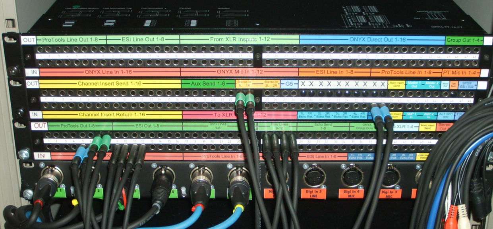

# Patch bay

The patch bay (or simply bay) allows [channels](../channels/) to be registered
with their name so they are visible to all parts of the emulator and provides a
way to run callbacks when the channels update their values.

The name follows from the [patch bay](https://en.wikipedia.org/wiki/Patch_panel)
used to connect audio channels:

## Registering channels

Channels are registered with `bay_register()`, using the channel name as a
unique identifier. It is an error to register multiple channels with the same
name.

The register step sets the channel callback function, so the bay can detect
which channel become dirty and act upon them.

## Callbacks

After registering a channel in the bay, multiple callbacks can be registered
with `bay_add_cb()` and will be called in same order they were added.

The callbacks are executed in the propagation phase, when `bay_propagate()` is
called. There are two types of callbacks: *dirty* and *emit*.

All dirty callbacks are called first, for all the channels that are dirty.
Executing the dirty callbacks may cause other channels to become dirty too,
which will be added to the list of dirty channels. Channels that are already
dirty cannot be modified, so we prevent an infinite updating loop.

Then the emit callbacks are called for each dirty channel in the same way. The
emit callbacks are generally used to write the values of the channels in the
output traces. These callbacks cannot cause any new channel to become dirty.

Finally, all channels are flushed by calling `chan_flush()`, clearing the dirty
flag and leaving them ready for the next input event.
