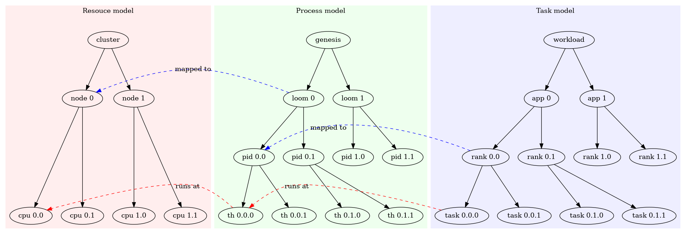

# Emulation overview

The emulator reads the events stored during runtime and reconstructs the
execution, restoring the state of each thread and CPU as time evolves. During
the emulation process, a detailed trace is generated with the state of the
execution in the Paraver PRV format.

The emulator has an execution model to represent the real execution that
happened on the hardware. It consists of CPUs which can execute multiple threads
at the same time.

The emulator uses several models to identify how the resources are being
used. The following diagram despicts the resource, process and task
model.

The resource model directly maps to the available hardware on the
machine. It consists of clusters which contains nodes, where each node
contains a set of CPUs that can execute instructions.

The process model tracks the state of processes and threads. Processes
that use the same CPUs in a single node are grouped into looms.

The task model includes the information of MPI and tasks of the
programming model (OmpSs-2).
