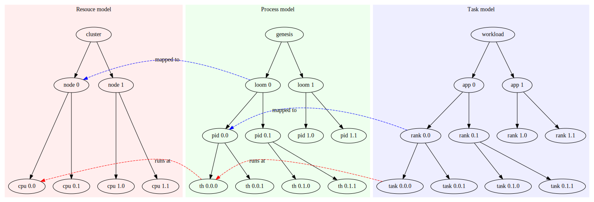

# Emulation overview

The emulator `ovniemu` reads the events stored during runtime and
reconstructs the execution, restoring the state of each thread and CPU
as time evolves. During the emulation process, a detailed trace is
generated with the state of the execution in the Paraver PRV format.

The emulator has an execution model to represent the real execution that
happened on the hardware. It consists of CPUs which can execute multiple threads
at the same time.

The emulator uses several models to identify how the resources are being
used. The following diagram despicts the resource, process and task
model.

The resource model directly maps to the available hardware on the
machine. It consists of a cluster which contains nodes, where each node
contains a set of CPUs that can execute instructions.

The process model tracks the state of processes and threads. Processes
that use the same CPUs in a single node are grouped into looms.

The task model includes the information of MPI and tasks of the
programming model (OmpSs-2).

## Design considerations

The emulator tries to perform every posible check to detect if there is
any inconsistency in the received events from the runtime trace. When a
problem is found, the emulation is aborted, forcing the user to report
the problem. No effort is made to let the emulator recover from an
inconsistency.

The emulator critical path is kept as simple as possible, so the
processing of events can keep the disk writting as the bottleneck.

The linter mode enables more tests which are disabled from the default
mode to prevent costly operations running in the emulator by default.
The linter tests are enabled when running the ovni testsuite.

## Emulation models

Each component is implemented in an emulation model, which consists of
the following elements:

- A single byte model identification (for example `O`).
- A set of runtime events with that model identification (see the [list
  of events](events)).
- Rules that determine which sequences of events are valid.
- The emulation hooks that process each event and modify the state of
  the emulator.
- A set of channels that output the states from the emulator.
- A set of Paraver views that present the information in a timeline.

All the models are independent and can be instrumented at the same time.
