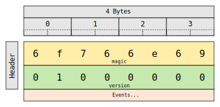
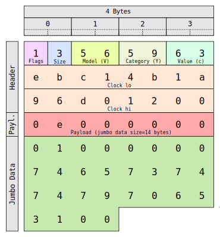

# Trace specification

!!! Important

	This document refers to the trace specification for
	the version 2

The ovni instrumentation library stores the information collected in a
trace following the specification of this document.

The complete trace is stored in a top-level directory named `ovni`.
Inside this directory you will find the loom directories with the prefix
`loom.`. The name of the loom is built from the `loom` parameter of
`ovni_proc_init()`, prefixing it with `loom.`.

Each loom directory contains one directory per process of that loom. The
name is composed of the `proc.` prefix and the PID of the process
specified in the `pid` argument to `ovni_proc_init()`.

Each process directory contains:

- The process metadata file `metadata.json`.
- The thread streams, composed of:
    - The binary stream like `thread.123.obs`
    - The thread metadata like `thread.123.json`

## Process metadata

!!! Important

	Process metadata has version 2

The process metadata file contains important information about the trace
that is invariant during the complete execution, and generally is
required to be available prior to processing the events in the trace.

The metadata is stored in the JSON file `metadata.json` inside each
process directory and contains the following keys:

- `version`: a number specifying the version of the metadata format.
  Must have the value 2 for this version.
- `app_id`: the application ID, used to distinguish between applications
  running on the same loom.
- `rank`: the rank of the MPI process (optional).
- `nranks`: number of total MPI processes (optional).
- `cpus`: the array of $`N_c`$ CPUs available in the loom. Only one
  process in the loom must contain this mandatory key. Each element is a
  dictionary with the keys:
  - `index`: containing the logical CPU index from 0 to $`N_c - 1`$.
  - `phyid`: the number of the CPU as given by the operating system
    (which can exceed $`N_c`$).

Here is an example of the `metadata.json` file:

```
{
    "version": 2,
    "app_id": 1,
    "rank": 0,
    "nranks": 4,
    "cpus": [
        {
            "index": 0,
            "phyid": 0
        },
        {
            "index": 1,
            "phyid": 1
        },
        {
            "index": 2,
            "phyid": 2
        },
        {
            "index": 3,
            "phyid": 3
        }
    ]
}
```

## Thread metadata

!!! Important

	Thread metadata has version 2

The thread metadata stores constant information per thread, like the
process metadata. The information is stored in a dictionary, where the
name of the emulation models are used as keys. In particular, the
libovni library writes information in the "ovni" key, such as the
model requirements, and other information like the version of libovni
used. Example:

```json
{
    "version": 2,
    "ovni": {
        "lib": {
            "version": "1.4.0",
            "commit": "unknown"
        },
        "require": {
            "ovni": "1.0.0"
        }
    }
}
```

The metadata is written to disk when the thread is first initialized
and when the thread finishes.

## Thread binary streams

!!! Important

	Thread binary stream has version 1

Streams are a binary files that contains a succession of events with
monotonically increasing clock values. Streams have a small header and
the variable size events just after the header.

The header contains the magic 4 bytes of "ovni" and a version number of
4 bytes too. Here is a figure of the data stored in disk:



Similarly, events have a fixed size header followed by an optional
payload of varying size. The header has the following information:

- Event flags
- Payload size in a special format
- Model, category and value codes
- Time in nanoseconds

The event size can vary depending on the data stored in the payload. The
payload size is specified using 4 bits, with the value `0x0` for no
payload, or with value $`v`$ for $`v + 1`$ bytes of payload. This allows
us to use 16 bytes of payload with value `0xf` at the cost of
sacrificing payloads of one byte.

There are two types of events, depending of the size needed for the
payload:

- Normal events: with a payload up to 16 bytes
- Jumbo events: with a payload up to $`2^{32}`$ bytes

## Normal events

The normal events are composed of:

- 4 bits of flags
- 4 bits of payload size
- 3 bytes for the MCV
- 8 bytes for the clock
- 0 to 16 bytes of payload

Here is an example of a normal event without payload, a total of 12
bytes:

```
00 4f 48 65 01 c5 cf 1d  96 d0 12 00              |.OHe........|
```

And in the following figure you can see every field annotated: 


Another example of a normal event with 16 bytes of payload, a total of
28 bytes:

```
0f 4f 48 78 58 c1 b0 b5  95 43 11 00 00 00 00 00  |.OHxX....C......|
ff ff ff ff 00 00 00 00  00 00 00 00              |............|
```

In the following figure you can see each field annotated:


## Jumbo events

The jumbo events are just like normal events but they can hold large
data. The size of the jumbo data is stored as a 32 bits integer as a
normal payload, and the jumbo data just follows the event.

- 4 bits of flags
- 4 bits of payload size (always 4 with value 0x3)
- 3 bytes for the MCV
- 8 bytes for the clock
- 4 bytes of payload with the size of the jumbo data
- 0 to 2^32 bytes of jumbo data

Example of a jumbo event of 30 bytes in total, with 14 bytes of jumbo
data:

```
13 56 59 63 eb c1 4b 1a  96 d0 12 00 0e 00 00 00  |.VYc..K.........|
01 00 00 00 74 65 73 74  74 79 70 65 31 00        |....testtype1.|
```

In the following figure you can see each field annotated:



## Design considerations

The stream format has been designed to be very simple, so writing a
parser library would take no more than 2 days for a single developer.

The size of the events has been designed to be small, with 12 bytes per
event when no payload is used.

!!! Caution

	The events are stored in disk following the endianness of the
	machine where they are generated. So a stream generated with a
	little endian machine would be different than on a big endian
	machine. We assume the same endiannes is used to write the trace
	at runtime and read it after, at the emulation process.

The events are designed to be easily identified when looking at the
raw stream in binary, as the MCV codes can be read as ASCII characters:

```
00000000  6f 76 6e 69 01 00 00 00  0f 4f 48 78 08 ba 2e 5c  |ovni.....OHx...\|
00000010  b5 b0 00 00 00 00 00 00  ff ff ff ff 00 00 00 00  |................|
00000020  00 00 00 00 13 56 59 63  3c c2 2e 5c b5 b0 00 00  |.....VYc<..\....|
00000030  0e 00 00 00 01 00 00 00  74 65 73 74 74 79 70 65  |........testtype|
00000040  31 00 07 56 54 63 43 cc  2e 5c b5 b0 00 00 01 00  |1..VTcC..\......|
00000050  00 00 01 00 00 00 03 56  54 78 03 cd 2e 5c b5 b0  |.......VTx...\..|
00000060  00 00 01 00 00 00 03 56  54 70 2b 7d 37 5c b5 b0  |.......VTp+}7\..|
00000070  00 00 01 00 00 00 03 56  54 72 c3 4d 40 5c b5 b0  |.......VTr.M@\..|
00000080  00 00 01 00 00 00 03 56  54 65 03 36 49 5c b5 b0  |.......VTe.6I\..|
00000090  00 00 01 00 00 00 00 4f  48 65 f5 36 49 5c b5 b0  |.......OHe.6I\..|
000000a0  00 00                                             |..|
```

This allows a human to detect signs of corruption by visually inspecting
the streams.

## Limitations

The streams are designed to be read only forward, as they only contain
the size of each event in the header.

Currently, we only support using the threads as sources of events, using
one stream per thread. However, adding support for more streams from
multiple sources is planned for the future.
